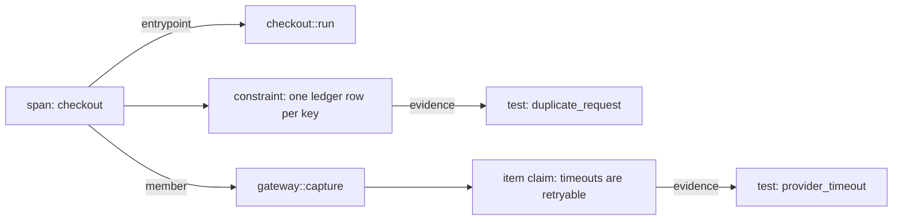
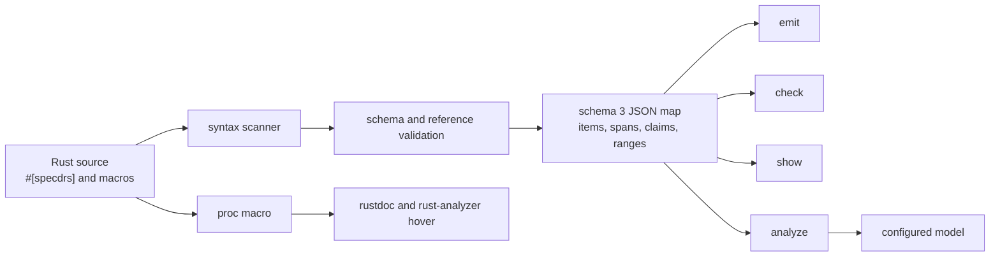
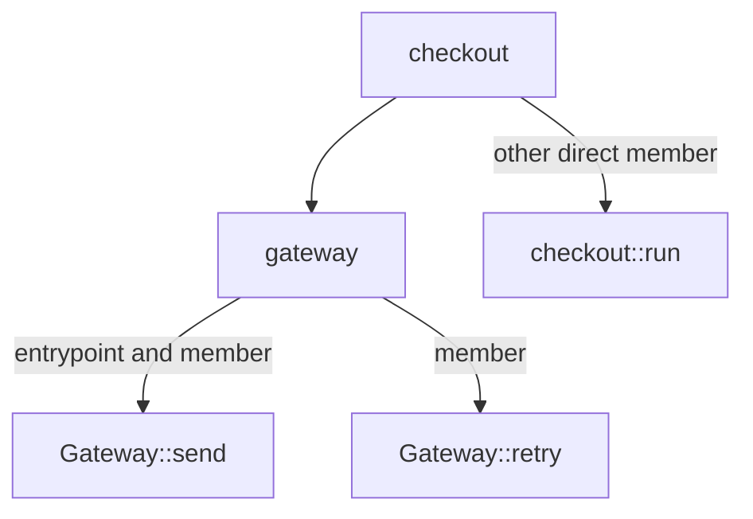
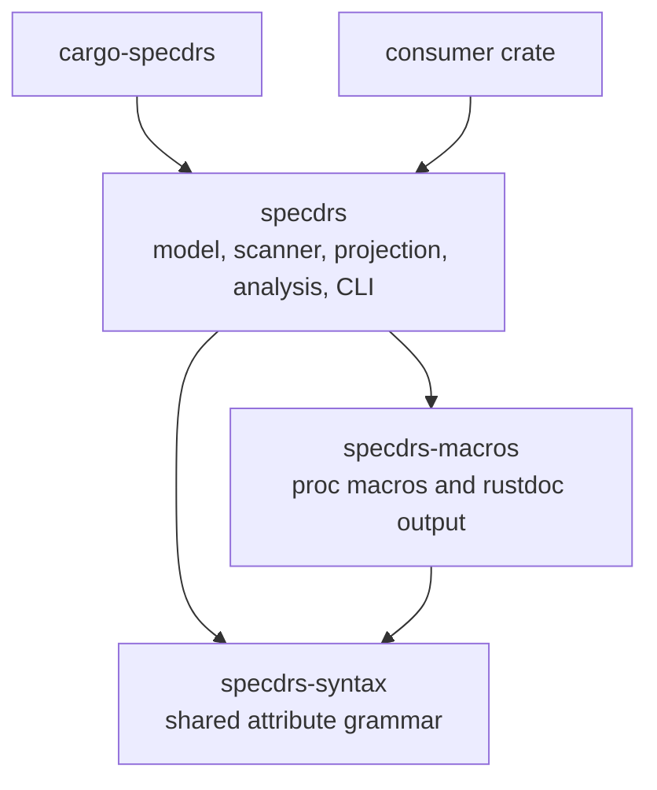

# specdrs

`specdrs` turns engineering intent embedded in Rust source into an evidence-linked
knowledge map.

Rust already records what the program does. It rarely records why a subsystem
exists, which constraints shaped it, or which test supports a claim. That context
usually ends up split across comments, tickets, and memory. `specdrs` keeps it next
to the implementation and emits a JSON index that agents, and tools can
navigate.

## What it records

A map connects four things:

- A **span** is a named semantic cut across one or more Rust items.
- An **item** is a function, type, trait, module, constant, static, or impl method.
- A **claim** is one falsifiable objective, constraint, or assumption.
- **Evidence** links a claim to a type, test, fuzz target, proof, or lint.



Claims use 12 axes so omissions are visible instead of silently treated as
decisions:

`Job`, `Interface`, `Effects`, `Invariants`, `Assumptions`, `State`, `Time`,
`Failure`, `Resources`, `Authority`, `Observation`, and `Change`.

Each axis is `Specified`, `NotApplicable`, or `Unspecified`. `NotApplicable`
requires a reason. `Unspecified` means nobody accounted for that axis.

## Why it exists

Source comments explain local code well. They are poor at describing a decision
that crosses modules, connecting that decision to evidence, or exposing what the
design never considered.

`specdrs` gives those decisions an address:

- Stable span IDs group code by purpose instead of directory layout.
- Claims separate objectives, constraints, and assumptions.
- Evidence binders resolve to exact Rust definition paths.
- Every item carries a source range, so a consumer can jump back to the code.
- Parent spans preserve context without copying claims onto every member.
- Rust-analyzer hovers show metadata authored directly on an item.

It does not replace Rust, tests, rustdoc, or a design document. It indexes the
links between them.

## How it works



The scanner and proc macro share the same grammar. Invalid annotations fail both
`cargo check` and `cargo specdrs check`.

Only `cargo specdrs analyze` contacts a model. `how`, `emit`, `check`, and `show`
are local and deterministic.

## Quick start

Install the Cargo subcommand from this checkout:

```console
cargo install --path .
```

Add `specdrs` to the crate being mapped. Use the path to this checkout while the
crate is not sourced from a registry:

```toml
[dependencies]
specdrs = { path = "../specdrs" }
```

Import the authoring macros:

```rust
use specdrs::prelude::*;
```

Declare a span and its contract:

```rust
use specdrs::prelude::*;

specdrs_span!(
    id = "checkout",
    entrypoint = crate::checkout::run,
    claims(
        Objectives(
            Job(
                "Complete one commercial checkout." as complete_checkout,
            ),
        ),
        Constraints(
            Invariants(
                "One idempotency key creates at most one ledger row." as one_ledger_row,
            ),
        ),
        Assumptions(
            Assumptions(
                "The payment provider preserves idempotency keys." as provider_idempotency,
            ),
        ),
        NotApplicable(
            State = "Checkout retains no process-local state.",
        ),
        evidence(
            one_ledger_row(Test = crate::tests::duplicate_request),
        ),
    ),
);
```

Join an item to the span and give it a narrower claim:

```rust
#[specdrs(
    in_spans("checkout"),
    claims(
        Constraints(
            Failure(
                "A provider timeout is returned as retryable." as timeout_is_retryable,
            ),
        ),
        evidence(
            timeout_is_retryable(Test = crate::tests::provider_timeout),
        ),
    ),
)]
fn capture() {
    // implementation
}
```

Then inspect the crate:

```console
cargo specdrs check
cargo specdrs emit
cargo specdrs show checkout
```

`emit` writes `target/specdrs/<crate>.json` by default.

## Pick the right attachment

### `#[specdrs(...)]`

Attach metadata to a real Rust item. It can declare a span, join spans, and own
item claims. The proc macro adds a `## specdrs` section to rustdoc output.

```rust
#[specdrs(in_spans("checkout", "payments"))]
fn capture() {}
```

When an attribute declares a span, its host and resolved entrypoint both become direct
members. If they are the same item, membership appears once.

### `specdrs_span!(...)`

Declare a span without inventing a host item. `entrypoint` is required.

```rust
specdrs_span!(
    id = "payments",
    entrypoint = crate::checkout::run,
);
```

Use this for crate-level or cross-module cuts. It emits no synthetic Rust item and
has no hover target.

### `specdrs_module!(...)`

Enroll the containing module and every descendant without repeating attributes:

```rust
specdrs_module!(in_spans("checkout"));
```

Nested module declarations and item-level memberships append to the inherited
set. Duplicate IDs collapse to one membership.

### Container spans

A span on an `impl` block includes every method in that block:

```rust
#[specdrs(
    span(
        id = "gateway",
        parent = "checkout",
        entrypoint = self::Gateway::send,
    )
)]
impl Gateway {
    pub fn send(&self) {}
    pub fn retry(&self) {}
}
```



An `impl` block has no definition path, so it cannot own item claims. Put the
claim on a method, type, or span.

## Commands

```text
cargo specdrs how
cargo specdrs emit [--stdout | --output <path>] [--manifest-path <path>] [-p <package>]
cargo specdrs check [--manifest-path <path>] [-p <package>]
cargo specdrs show <span-or-item> [--group-by kind,axis,owner] [--json] [--manifest-path <path>] [-p <package>]
cargo specdrs analyze [--span <id>]... [--item <path>]... [--jobs <count>] [--json] [--manifest-path <path>] [-p <package>]
```

| Command | What it does | Contacts a model |
| --- | --- | --- |
| `how` | Prints the authoring guide. | No |
| `emit` | Writes the schema 3 map. | No |
| `check` | Validates syntax, span structure, references, and evidence resolution. | No |
| `show` | Projects claims for one span or item, including inherited span claims. | No |
| `analyze` | Compares claims with the selected source using `specdrs.toml`. | Yes |

`check` does not prove that prose matches code. Attributes declare requirements.
They do not enforce them. `analyze` is the optional semantic audit.

## Generated map

The JSON map uses schema version 3. This excerpt omits the other axis entries:

```json
{
  "schema": 3,
  "crate": "payments",
  "spans": [
    {
      "id": "checkout",
      "parent": null,
      "entrypoint": "payments::checkout::run",
      "members": ["payments::checkout::run"],
      "axes": {
        "Job": {
          "status": "Specified",
          "claims": []
        }
      }
    }
  ],
  "items": {
    "payments::checkout::run": {
      "source": {
        "file": "src/checkout.rs",
        "start": { "line": 12, "column": 0 },
        "end": { "line": 38, "column": 1 }
      },
      "signature": "pub fn run(request: Request) -> Result<Receipt, Error>",
      "spans": ["checkout"],
      "axes": {}
    }
  }
}
```

The real output contains all 12 axes for every span and scanned item. Evidence
results are `Linked` or `Unavailable`. `Passed` and `Failed` are reserved for a
future evidence runner. No current command executes linked tests, fuzz targets,
proofs, or lints.

## Workspace structure



The root crate maps its own architecture. Run these commands from this repository
to inspect that map:

```console
cargo run --bin cargo-specdrs -- check
cargo run --bin cargo-specdrs -- show specdrs
cargo run --bin cargo-specdrs -- emit --stdout
```

See [DESIGN.md](DESIGN.md) for parser rules, map invariants, analyzer behavior,
and the crate's dogfood span hierarchy.

## Current boundaries

- Only the selected package's library target is scanned.
- Calls do not imply membership. Membership is explicit.
- Container spans cannot accept outside members after the container seeds members.
- `specdrs-macros` cannot annotate itself because a proc-macro crate cannot apply
  its own procedural attribute.
- `specdrs-syntax` cannot depend on the macro crate without creating a dependency
  cycle.

## License

Apache-2.0. See [LICENSE](LICENSE).
